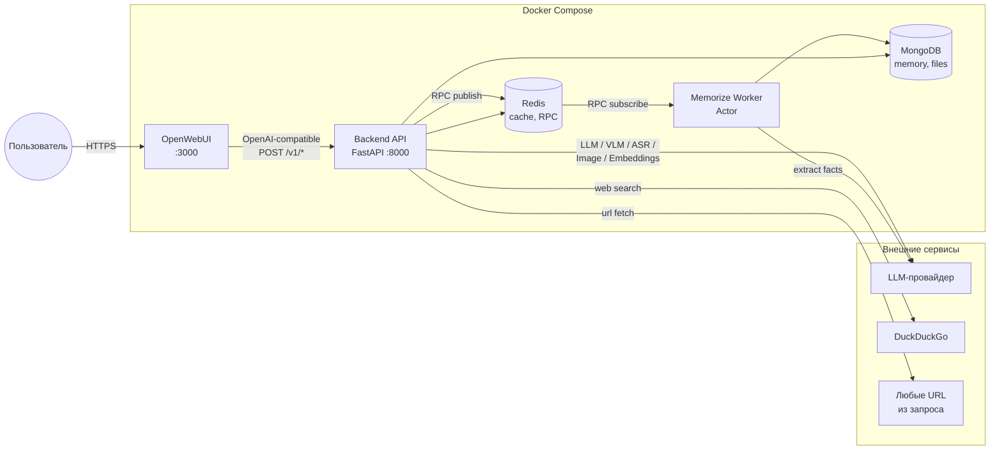
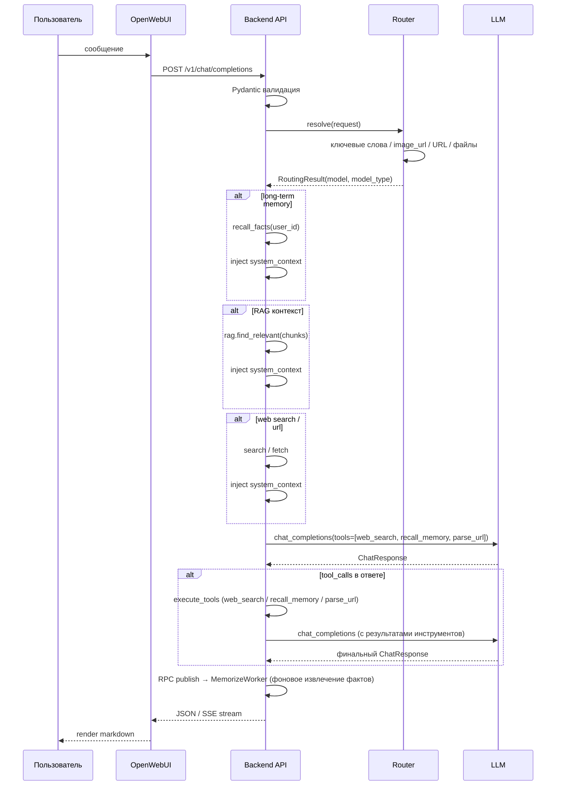
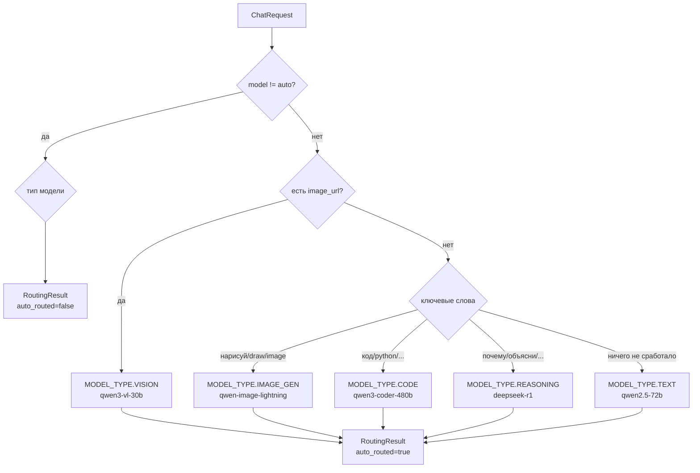
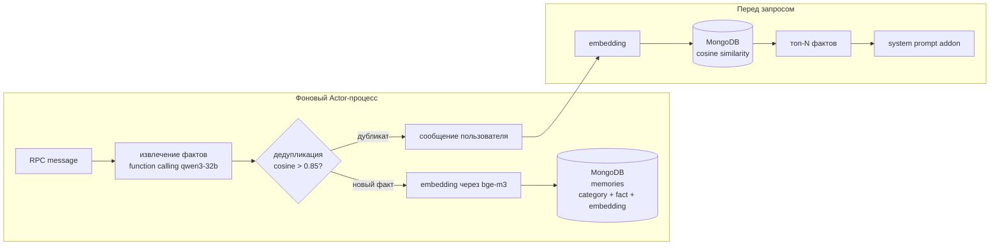
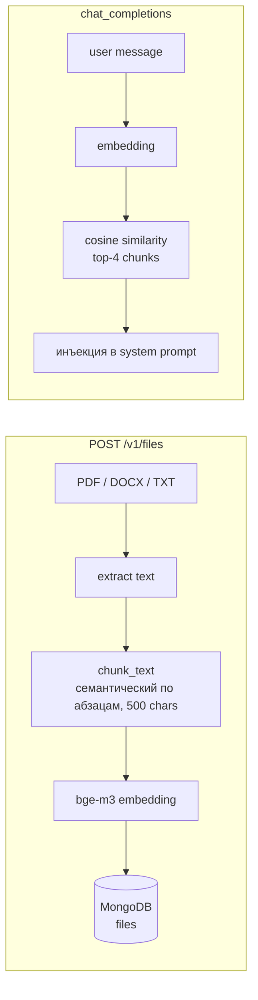

# Архитектура GPTHub

## Контур сервисов



## User Flow — общий чат



## Layer architecture

```mermaid
flowchart TB
    subgraph Input["Входной слой"]
        API[api_v1.py<br/>Resources]
    end

    subgraph Coord["Координация"]
        CTRL[controls.py<br/>GPTHubControl<br/>ChatControl<br/>MemoryControl<br/>FileControl<br/>AudioControl]
    end

    subgraph Background["Фоновые процессы"]
        RPC[rpc.py<br/>MemorizeRPC]
        ACTOR[actors/memorize.py<br/>MemorizeWorker]
    end

    subgraph Output["Выходной слой"]
        REST[rest.py<br/>LLMProviderAPI]
        CLI[clients.py<br/>WebParserClient<br/>WebSearchClient]
    end

    subgraph Storage
        MONGO[mongodb.py<br/>Document + query functions]
        CACHE[rediscache<br/>@acached]
    end

    subgraph Shared
        STRUCT[structures.py<br/>dataclass]
        MODELS[models.py<br/>Pydantic]
        CONST[constants.py<br/>Enum, routing, TTL]
    end

    API --> CTRL
    API --> RPC
    RPC --> ACTOR
    ACTOR --> CTRL
    CTRL --> REST
    CTRL --> CLI
    CTRL --> MONGO
    REST -.-> CACHE
    CLI -.-> CACHE

    API -.-> MODELS
    CTRL -.-> STRUCT
    REST -.-> STRUCT
    CTRL -.-> CONST
```

### Правила взаимодействия слоёв

| Может                          | Нельзя                                |
|--------------------------------|---------------------------------------|
| `api_v1` → `controls`          | `api_v1` → `rest` (обход controls)    |
| `controls` → `rest`            | `rest` → `rest`                       |
| `controls` → `clients`         | `rest` → `controls` (обратный вызов)  |
| `controls` → `mongodb`         |                                       |
| `controls` → `controls`        |                                       |

## Роутер



## Долгосрочная память



Хранение: `MongoDB.memories` — коллекция с `user_id`, `fact`, `embedding`, `source` (category: name/job/location/interest/...), `created_at`. Дедупликация по cosine similarity > 0.85. Извлечение фактов через function calling (Pydantic schema → tool_calls).

## RAG



## Кэширование

`rediscache.@acached` с TTL:

| Кэш                     | TTL         | Функция                             |
|-------------------------|-------------|-------------------------------------|
| Список моделей          | 10 минут    | `LLMProviderAPI.get_models`              |
| Embeddings              | 24 часа     | `LLMProviderAPI.get_embeddings`          |
| Веб-страница по URL     | 1 час       | `WebParserClient.get`               |
| Результаты веб-поиска   | 15 минут    | `WebSearchClient.search`            |

Ключи формируются как `gpthub/<sha1(func_name + args + kwargs)>` — стабильны между перезапусками процесса благодаря `Cacheable` mixin и явным `__repr__`.
