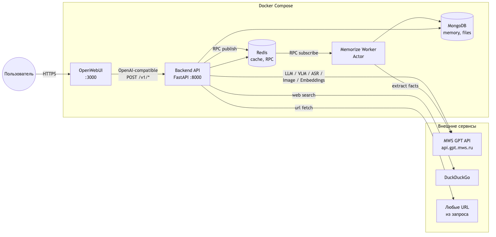

# GPTHub

Единое рабочее пространство для ИИ-задач — чат, голос, изображения, файлы, веб-поиск, долгосрочная память и генерация презентаций в одном интерфейсе.

OpenAI-совместимый backend поверх любого LLM-провайдера: Ollama (локально без ключей), OpenAI, vLLM, Anthropic (через litellm-proxy), приватные корпоративные шлюзы.



## Возможности

- **Текстовый чат** с разметкой Markdown, подсветкой кода и SSE-стримингом
- **Голосовой ввод** через микрофон (ASR-модель на backend)
- **Анализ изображений** (VLM) — прикрепил фото, модель описывает содержимое
- **Генерация изображений** по текстовому запросу
- **Аудиофайлы** — загрузка и автоматическая транскрипция
- **RAG по файлам** — PDF, DOCX, TXT: эмбеддинги, семантический поиск по чанкам
- **Веб-поиск** как инструмент агента (DuckDuckGo)
- **Парсинг URL** — модель сама вытягивает содержимое страниц
- **Долгосрочная память** — факты о пользователе сохраняются между сессиями, per-user изоляция
- **Автовыбор модели** под задачу (код, рассуждения, vision, image_gen и т.д.) с fallback-цепочками
- **Ручной выбор** любой модели из доступных на провайдере
- **Multi-user** — память и файлы изолированы по пользователю через заголовок `X-OpenWebUI-User-Id`

### Агентная оркестрация

Модель решает сама, какой инструмент подключить под конкретный запрос. Пять инструментов через function calling:

- `WebSearch` — поиск в интернете
- `RecallMemory` — вспомнить сохранённые факты
- `SearchFiles` — RAG по загруженным документам
- `ParseUrl` — парсинг содержимого веб-страницы
- `BuildPresentation` — генерация редактируемого PPTX

Процесс работы агента **виден в чате**: маршрут модели, вызов инструмента с аргументами, результаты — стримятся блок-цитатами до финального ответа.

### Deep Research

Для глубоких вопросов модель разбивает задачу на подзапросы, параллельно запускает поиск по каждому, агрегирует источники и синтезирует итоговый ответ. Прогресс подзапросов транслируется в чат в реальном времени.

## Быстрый запуск

### Вариант 1: Локально через Ollama (без ключей)

```bash
cp .env.example .env
docker compose --profile ollama up -d

# Подтянуть модели (один раз):
docker exec gpthub-ollama ollama pull qwen2.5:7b
docker exec gpthub-ollama ollama pull qwen2.5-coder:7b
docker exec gpthub-ollama ollama pull bge-m3
```

Всё работает локально, без регистраций и внешних API.

### Вариант 2: С любым OpenAI-совместимым провайдером

```bash
cp .env.example .env
# В .env:
#   LLM_API_BASE_URL=https://api.openai.com/v1
#   LLM_API_KEY=sk-...

# Вписать ключ в config_docker.json → api.llm.key
docker compose up -d
```

После запуска:

- **Чат**: <http://localhost:3000>
- **API**: <http://localhost:8000/v1>
- **Health**: `curl http://localhost:8000/v1/health`
- **MinIO**: <http://localhost:9001>

## Архитектура

3-слойная, плоская структура проекта:

```
api_v1.py  →  controls.py  →  rest.py / clients.py
(вход)        (координация)    (выход)
```

Подробная схема и user flow: [docs/architecture.md](docs/architecture.md)  
Матрица возможностей: [docs/features.md](docs/features.md)

### Компоненты

| Сервис       | Назначение                                              |
|--------------|---------------------------------------------------------|
| `backend`    | FastAPI, OpenAI-совместимый API, роутинг, агент         |
| `openwebui`  | Frontend (OpenWebUI)                                    |
| `memorize`   | Actor-воркер фонового извлечения фактов в память        |
| `mongodb`    | Persistent: память, индекс файлов                       |
| `redis`      | Кэш моделей/эмбеддингов, очередь RPC                    |
| `minio`      | S3-хранилище сгенерированных PPTX                       |
| `ollama`     | Локальный LLM-провайдер (опциональный профиль)          |

### Инженерные особенности

- **Multi-user изоляция** памяти и RAG через `X-OpenWebUI-User-Id` → `user_id` в Mongo-моделях
- **Dynamic model fallback** — `MODEL_FALLBACK` цепочки под тип задачи; если preferred модель недоступна на провайдере, автоматически подбирается следующая
- **Actor + Redis PubSub** — извлечение фактов идёт в фоне, не блокирует чат
- **Semantic chunking** + `bge-m3` эмбеддинги для RAG
- **Memory dedup** через cosine similarity (порог 0.92)
- **Live-трассировка** действий агента в SSE-потоке — observability из коробки
- **OpenAI-compatible API** — backend подходит как dropin-прокси для любого клиента

## Стек

Python 3.11 · FastAPI · MongoDB 7 · Redis 7 · MinIO · OpenWebUI · python-pptx · bge-m3

## Разработка

```bash
task server              # запуск API
task run worker.memorize # воркер памяти
task test                # тесты
task lint                # линтер
```

## Конфигурация

Все настройки в `config_fastapi.json` (локальный запуск) или `config_docker.json` (docker-compose).

Секция `api.llm`:

```json
{
  "api": {
    "llm": {
      "url": "http://ollama:11434/v1",
      "key": "",
      "default_model": "qwen2.5:7b",
      "vision_model": "qwen2.5vl:7b",
      "code_model": "qwen2.5-coder:7b",
      "embedding_model": "bge-m3"
    }
  }
}
```

Меняешь `url` и `key` — работаешь с любым OpenAI-совместимым провайдером.

## Troubleshooting

- **Порты заняты** — нужны свободные `3000`, `8000`, `9000-9001`, `6379`, `27017`, `11434` (Ollama)
- **Модель не найдена** — `docker exec gpthub-ollama ollama pull <имя>` для Ollama, или проверить что модель есть в `GET /v1/models` провайдера
- **Сброс памяти/истории** — `docker compose down && docker volume rm gpthub_mongodb_data gpthub_openwebui_data`
- **Логи** — `docker compose logs backend memorize openwebui`
- **STT (микрофон)** — работает только на `http://localhost` или `https://`, не на LAN-IP (ограничение браузера)

## Лицензия

MIT. См. [LICENSE](LICENSE).
